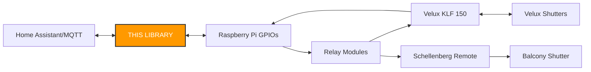
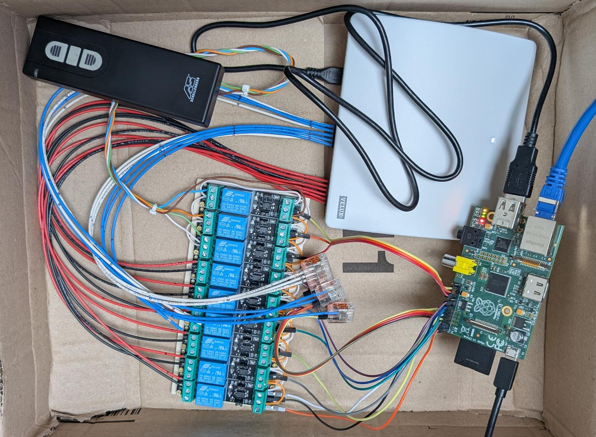
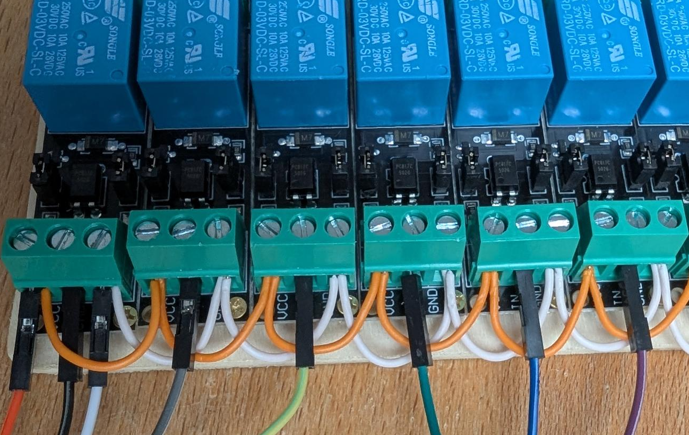
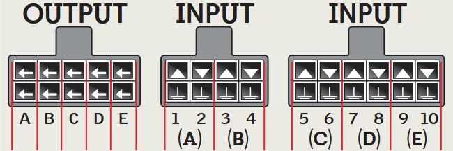

# MQTT shutter bridge for home assistant or alike

This is an implementation of a bridge between shutter controls and home assistant.

In particular I have connected one Velux KLF 150 gateway and one Schellenberg shutter remote to my Raspberry Pi using the GPIO pins.

But you can use this for Velux only, of course. You will need 3 GPIO pins for each Velux shutter and you can use up to 5 shutters with the KLF 150 in this setup.

**No soldering** required if you stick with Velux only - everything is just screws.

## Features

- Supports Velux KLF 150 or any 3-button remote control
- MQTT interface with auto-discovery for home assistant
- Positioning of the Velux shutters (time-based)

## Flow chart



# Hardware

## Before unboxing

This is how everything looks before "unboxing" it into a more permanent shape:



## My hardware

Just to give you an insight, you can pobably use this project with any other hardware. It could make sense to buy a complete ESP32 GPIO board instead of using a Raspberry Pi.

- 1 Schellenberg shutter motor in my balcony door
- 1 Schellenberg remote control
  - Which I opened up and soldered contacts to all three buttons (up/stop/down) as well as the power supply.
  - This way I can supply power directly via the 3V GPIO output of the raspberry pi without needing batteries.
  - I'm trusting you with this [definitely professional piece of art](docs/schellenberg.png).
- 3 Velux covers/shutters on my roof windows
- Velux KLF 150 gateway
  - See https://www.velux.com/klf150
  - Before buying this, I also tried soldering contacts to the Velux remotes (model 3UR B01 WW), but I broke the first...
- 9 relay modules
  - If you use a Raspberry PI, you need relays that work with 3V and it helps if they already have a pull-up resistor because the GPIO pins can have a floating voltage when the PI boots and they are not yet assigned as outputs, triggering the relay when it shouldn't.
  - I bought [this 10 pack on amazon](https://www.amazon.de/dp/B0F53QDMXG) 
  - You will need 2 relays per Velux shutter, so for my three windows I needed 6 relays.
  - Additionally I needed 3 relays for my Schellenberg remote control.
  - If you find a board with multiple 3V relays on it, go ahead. I just screwed mine together on a wooden board.
- Raspberry Pi Model B
  - Yes, the first version of the Raspberry Pi with the single armv6 CPU!
  - Still had this lying around, so why waste it.
  - I got node 21 running on it for this project.
- One USB power supply for the Raspberry Pi
  - I used one of my many 2A supplies, not the 1.4A one that comes with the Velux KLF 150.
  - The Pi then powers the relays, the KLF 150 and the Schellenberg remote.

## Wiring GPIOs to the relays



- Connect all **VCC** pins of the relays to a 3V GPIO pin of the Raspberry Pi.
  - I have daisy chained them together. Only the most left relay is connected to the Pi.
- Connect all **GND** pins of the relays to a GND pin of the Raspberry Pi.
  - Again daisy chained.
- Connect each **IN** pin of the relays to one GPIO pin of the Raspberry Pi.
  - If you use all 10 relays, for all 5 shutters, I'm [suggesting](./example.ts) pins [2, 3, 4, 17, 27, 22, 10, 9, 11, 8](https://pinout.xyz/).

## Wiring the Velux KLF 150 to the rest



This is for the default configuration as described in the Velux KLF 150 manual. Meaning: You have 2 output pins and 4 input pins per shutter (A, B, C, D, E). For each shutter, the first input pin makes the shutter open, the second input pin makes it close, and both together make the shutter stop. The output pins for each shutter should close on success (also the default behavior).

### Outputs

- Connect all 5 bottom pins of the output (A-E) together and to GND.
- Connect all 5 top pins of the output (A-E) to any GPIO pin.
  - I'm [suggesting](./example.ts) pins [14, 15, 18, 23, 24](https://pinout.xyz/).

### Inputs

- The bottom line of all input pins are for GND. However, since the cabling comes in pairs anyway and you need to connect them each to one of the relays, I just used all the existing cables.
- So connect all 10 inputs to the 10 relays, the top one to **NO** (normally open) and the bottom one to **COM** (common). 

# Software

- Create a javascript file, require my library and call it with your shutter-pin-layout:

```js
import {createVeluxShutters, initRuntime, initMqtt} from '@uncaught/gpio-shutter-bridge';

const {onDispose} = initRuntime();

onDispose(initMqtt(createVeluxShutters([
  {ident: 'Velux_A', up: 2, down: 3, input: 14},
  {ident: 'Velux_B', up: 4, down: 17, input: 15},
  {ident: 'Velux_C', up: 27, down: 22, input: 18},
  {ident: 'Velux_D', up: 10, down: 9, input: 23},
  {ident: 'Velux_E', up: 11, down: 8, input: 24}, //same row!
], onDispose), {url: 'mqtt://your-mqtt-or-home-assistant'}));
```

- The ident should match `/[a-zA-Z][a-zA-Z0-9_-]*/`.
- See [my personal example](./example.ts) for a few more details.
